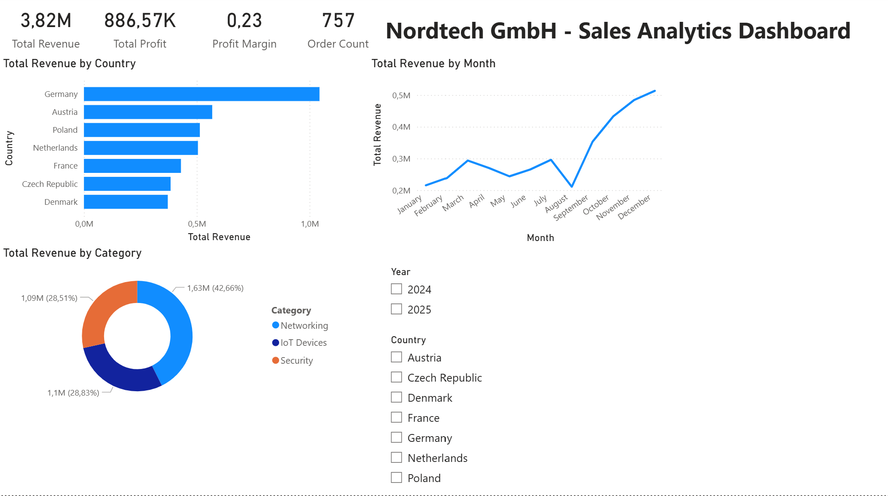

# NordTechGmbHAnalytics

Power BI dashboard analyzing sales performance and budget variance for NordTech GmbH, a synthetic European technology company operating across Germany, Netherlands, France, and other EU markets.

## Project Overview

This dashboard answers three business questions:
- How is actual revenue tracking against budget by month and category?
- Which products and regions drive the most revenue?
- How do sales reps perform across different territories?

## Data Model

Four tables connected in a star schema:
- **Sales** (fact table): order-level transactions with revenue, cost, and status
- **Products**: product catalog with categories and unit costs
- **Regions**: countries, cities, and sales reps
- **Budget**: monthly revenue targets by category

## Tools

- Power BI Desktop
- DAX for measures
- Power Query for data transformation

## How to Open

1. Clone or download this repository
2. Open `NordTechGmbHAnalytics.pbix` in Power BI Desktop
3. If data sources need refreshing, point to the `/data` folder

## Screenshots

## Author

Ilias Benhmidane
[Portfolio](https://iliasben7.netlify.app)
